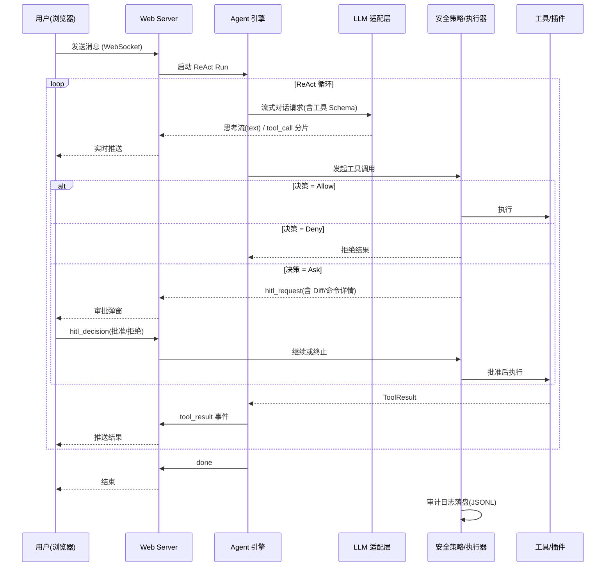

# CodeForge-Go 跨平台 Web-Agent 框架
# 项目开发计划书

| 项目 | 内容 |
|---|---|
| 项目名称 | CodeForge-Go 跨平台 Web-Agent 代理框架与可扩展插件引擎 |
| 项目代号 | 绣球（Hydrangea） / CodeForge-Go |
| 文档版本 | V1.0 |
| 文档状态 | 待评审 |
| 编制日期 | 2026-09-11 |
| 依据文档 | 《跨平台 Web-Agent 代理框架与可扩展插件引擎综合设计文档》 |
| 目标交付 | Go 单二进制 Web-Agent 服务（Linux / Termux / Windows 三平台） |

> 说明：本计划书依据《综合设计文档》（项目绣球文档 / 项目需求文档）制定，并吸收项目内既有的实施计划草案（`codeforge-web-agent-framework-plan.md`）。文中工期、人天均为基于阶段规模的合理估算，实际排期以立项批准日与团队投入为准。

---

## 1. 项目概述

### 1.1 项目背景

当前主流 AI 编程代理（Codex、Claude Code 等）已证明「Agent 循环 + 工具调用 + 人机协同」范式的生产力价值，但多数实现存在三类痛点：

1. **部署重**：依赖 Node.js / Python 运行时与大量第三方包，难以在低配云主机、树莓派、Android Termux 等资源受限环境运行；
2. **扩展难**：新增能力需改动核心代码，缺少统一的插件协议与安全边界；
3. **不可控**：危险操作（删除文件、执行高危 Shell）缺乏强制的人机审批与审计留痕。

本项目旨在用 **Go 语言** 从零构建一个 **零依赖、单二进制、可扩展、安全可控** 的轻量级 Web-Agent 框架，对标 Codex / Claude Code 的核心体验，同时兼顾跨平台与低资源占用。

### 1.2 项目意义

- **技术价值**：沉淀一套可复用的 Agent 引擎（ReAct 循环、上下文管理、工具注册与安全执行）与插件引擎（MCP / HTTP / WASM 多驱动）。
- **工程价值**：以 `CGO_ENABLED=0` 单二进制交付，Web 资源内嵌，开箱即用，显著降低分发与运维成本。
- **安全价值**：三级权限策略（Allow / Deny / Ask）+ Human-in-the-Loop 审批 + 审计日志，让「自动化」与「可控性」并存。
- **生态价值**：兼容 Anthropic MCP 协议，可直接复用社区 MCP 工具生态。

### 1.3 建设目标

**总体目标**：交付一个可在 Linux（x86_64 / arm64）、Android Termux（arm64）、Windows（x86_64）上运行的、类 Codex / Claude Code 的轻量级可扩展 Web-Agent 框架，用户通过浏览器即可与 Agent 交互、审批危险操作、查看代码 Diff。

**分项目标**：

| 编号 | 目标 | 关键指标 |
|---|---|---|
| G1 | 后端 Agent 引擎 | 实现 ReAct（思考—行动—观察）主循环、上下文窗口管理与自动压缩、会话历史持久化 |
| G2 | 工具链与安全执行 | 提供文件读写/编辑、Shell 执行、代码检索等内置工具；工具调用统一走三级安全策略 |
| G3 | 可扩展插件引擎 | 支持 Native Go / MCP-Stdio / HTTP Webhook / WASM 四种驱动，配置化加载 |
| G4 | 多 LLM 适配 | 统一适配 Anthropic、OpenAI/Codex、本地模型（Ollama / vLLM），支持流式输出与 Tool Call |
| G5 | Web 服务与前端 GUI | REST + WebSocket 双向通信；聊天流式渲染、工具卡片、Diff 高亮、HITL 审批弹窗、设置面板 |
| G6 | 安全与审计 | Allow / Deny / Ask 三级策略 + HITL 挂起审批 + JSONL 审计日志 |
| G7 | 跨平台与交付 | 单二进制（`CGO_ENABLED=0`）、Web 资源 `go:embed` 内嵌、静态内存 ≤ 30MB |

### 1.4 项目范围与边界

**本期范围（做）**：

- Agent 引擎、内置工具集、插件引擎（四驱动）、LLM 适配层、Web 服务、前端 GUI、安全与审计、跨平台构建。

**本期不做（列为后续增强）**：

- 交互式 PTY / ConPTY 完整终端（本期为异步命令执行 + 流式回传）；
- 引入 npm / xterm.js / Monaco Editor 的前端构建链（本期为纯 HTML/CSS/JS + 自研 Diff 渲染）；
- 多用户 / 云端多租户、账号体系（本期为本地单用户 + Token 鉴权）；
- 移动端原生 App、插件市场 / 在线分发。

---

## 2. 需求分析

### 2.1 功能性需求

| 编号 | 需求 | 说明 | 优先级 |
|---|---|---|---|
| FR-01 | Agent ReAct 循环 | 思考 → 工具调用 → 观察结果 → 继续，直至完成或达最大步数 | Must |
| FR-02 | 上下文窗口管理 | Token 实时估算，超预算时自动压缩（省略工具结果 / 丢弃最旧轮次） | Must |
| FR-03 | 会话历史与撤销 | 会话 JSON 持久化；文件写前快照入撤销栈，支持 undo | Must |
| FR-04 | 文件工具 | `read_file` / `list_dir` / `write_file` / `edit_file` / `delete_file`，编辑采用「读→旧串替换→写」 | Must |
| FR-05 | Shell 工具 | `run_command` 跨平台异步执行，流式收集输出，输出限幅 | Must |
| FR-06 | 代码检索 | `search_files` 关键字检索，支持路径 / glob / 忽略目录（`.git`、`node_modules` 等） | Must |
| FR-07 | Unified Diff 预览 | 文件修改自动生成 Unified Diff 并推送前端展示 | Must |
| FR-08 | 插件引擎 | 配置化加载 Native / MCP-Stdio / HTTP / WASM 四类插件 | Must |
| FR-09 | MCP 协议兼容 | stdio JSON-RPC 2.0：initialize → tools/list → tools/call | Must |
| FR-10 | LLM 多适配 | Anthropic / OpenAI / 本地模型统一接口，流式 + Tool Call | Must |
| FR-11 | Web 服务 | REST（配置/文件树/会话/撤销）+ WebSocket（事件流 + 审批） | Must |
| FR-12 | 前端 GUI | 会话列表、文件树、聊天流、工具卡片、HITL 审批弹窗、设置弹窗 | Must |
| FR-13 | 安全三级策略 | Allow / Deny / Ask，危险命令内置黑名单强制 Deny | Must |
| FR-14 | HITL 审批 | Ask 动作挂起 Agent，前端弹窗批准/拒绝后继续 | Must |
| FR-15 | 审计日志 | JSONL 记录时间、工具、决策、审批、结果 | Should |
| FR-16 | 本地鉴权 | 启动生成随机 Token，URL 注入前端，API/WS 校验 | Should |
| FR-17 | 浏览器自动拉起 | 跨平台调用 `xdg-open` / `termux-open-url` / `start` | Should |
| FR-18 | 插件热重载 | 运行时 Reload 插件配置 | Could |
| FR-19 | 交互式终端 | 完整 PTY / ConPTY 交互终端 | Could（后续） |
| FR-20 | 前端富编辑器 | Monaco Editor / xterm.js 集成 | Could（后续） |

### 2.2 非功能性需求

| 类别 | 需求 | 指标 |
|---|---|---|
| 交付形态 | 零依赖单二进制 | `CGO_ENABLED=0`，Web 资源 `go:embed` 内嵌，无外部运行时依赖 |
| 资源占用 | 低内存 | 静态内存 ≤ 30MB，可运行于 Termux / 树莓派 / 低配云主机 |
| 跨平台 | 三平台一致 | Linux x86_64/arm64、Termux arm64、Windows x86_64 |
| 性能 | 实时推流 | 思考流 / 终端流 / Diff 通过 WebSocket 实时推送，端到端延迟感知低 |
| 安全 | 默认安全 | 危险操作默认 Ask 或 Deny；审计可追溯；本地 Token 鉴权闭环 |
| 可扩展 | 插件化 | 新增工具无需改动核心，配置化加载，协议标准化 |
| 可维护 | 依赖最小 | 第三方依赖仅 `gorilla/websocket`、`gopkg.in/yaml.v3`、`tetratelabs/wazero`（均纯 Go） |
| 可用性 | 开箱即用 | 启动后自动拉起浏览器并注入 Token，无需手工配置地址 |

### 2.3 平台兼容性需求

| 兼容维度 | Linux (x86_64/arm64) | Termux (Android arm64) | Windows (x86_64) |
|---|---|---|---|
| 路径分隔符 | `/` (POSIX) | `/`（Termux 专有目录） | `\`，须规范化转换 |
| Shell / PTY | `/bin/bash` 或 `/bin/sh` | `/data/data/com.termux/files/usr/bin/bash` | `cmd.exe` / PowerShell |
| 浏览器打开 | `xdg-open` | `termux-open-url` | `start` / ShellExecute |
| 构建方式 | `GOOS=linux` | `GOOS=android` | `GOOS=windows` |

### 2.4 需求优先级（MoSCoW）

- **Must（必须）**：FR-01 ~ FR-14 —— 构成可用的最小闭环（MVP）。
- **Should（应该）**：FR-15 ~ FR-17 —— 安全审计与易用性提升。
- **Could（可以）**：FR-18 ~ FR-20 —— 体验增强，视资源投入择机实现。
- **Won't（本期不做）**：多租户、账号体系、插件市场、移动端 App。

---

## 3. 技术方案

### 3.1 总体架构

系统采用**前后端分离**架构，核心逻辑分为 **Web Frontend（浏览器端）** 与 **Go Backend Agent Service（服务端）** 两大部分，通过 **双向 WebSocket** 与 **REST API** 协同工作。

```mermaid
graph TD
    subgraph Web Frontend (浏览器端)
        UI[Chat / Diff / 设置 单页应用]
        Terminal[xterm.js 伪终端 - 后续]
        HITL_UI[Human-In-The-Loop 审批弹窗]
    end

    subgraph Go Backend Agent Service (后端服务)
        Server[pkg/server - HTTP & WebSocket 服务]
        Auth[pkg/security - 本地 Auth & 审计日志]
        Policy[pkg/security - 权限控制 & HITL 引擎]
        AgentCore[pkg/agent - ReAct 循环与上下文管理]
        LLM[pkg/llm - LLM 统一适配器]
        ToolRegistry[pkg/tools - 工具注册与安全执行器]
        subgraph Plugin Engine (插件引擎)
            PluginMgr[Plugin Manager]
            NativeTool[1. Native Go 内置工具]
            MCPDriver[2. MCP / Stdio 进程驱动]
            HTTPDriver[3. HTTP Webhook 驱动]
            WASMDriver[4. WASM 沙盒驱动]
        end
        Platform[pkg/platform - 跨平台抽象层 Termux/Linux/Windows]
    end

    UI <-->|REST API / WS| Server
    Terminal <-->|WebSocket PTY| Server
    HITL_UI <-->|WebSocket 实时决策| Policy
    Server <--> Auth
    Server <--> AgentCore
    AgentCore <--> LLM
    AgentCore <--> Policy
    Policy <--> ToolRegistry
    ToolRegistry <--> PluginMgr
    PluginMgr --> NativeTool
    PluginMgr --> MCPDriver
    PluginMgr --> HTTPDriver
    PluginMgr --> WASMDriver
    NativeTool <--> Platform
    MCPDriver <--> Platform
```

### 3.2 技术选型

| 层 | 选型 | 理由 |
|---|---|---|
| 后端语言 | Go | 静态编译、单二进制、并发模型契合 Agent 流式场景 |
| 构建约束 | `CGO_ENABLED=0` | 跨平台单文件交付，规避 C 依赖 |
| Web 框架 | 标准库 `net/http` + `gorilla/websocket` | 依赖最小，满足 REST + WS 需求 |
| 配置解析 | `gopkg.in/yaml.v3` | 纯 Go，YAML 可读性好 |
| WASM 沙盒 | `tetratelabs/wazero` | 纯 Go 无 CGO 的 WASM 运行时 |
| LLM 调用 | 原生 `net/http` + SSE 解析（不引入 SDK） | 控制依赖与内存占用 |
| 前端 | 纯 HTML / CSS / JS + `go:embed` | 零构建链，单文件交付；xterm/Monaco 后续增强 |
| 检索实现 | 纯 Go 目录遍历 + 逐行扫描 | 不依赖 `ripgrep` 二进制 |
| 前端资源内嵌 | `go:embed` | 前端产物打包进单一二进制 |

### 3.3 核心模块设计

| 模块 | 目录 | 职责 |
|---|---|---|
| 主程序入口 | `cmd/agent/` | 命令行解析、依赖装配、启动、拉浏览器、优雅退出 |
| 前端资源 | `web/` | `embed.go`（`go:embed`）+ `dist/`（SPA 静态资源） |
| Agent 核心引擎 | `pkg/agent/` | ReAct 主循环、上下文管理、历史持久化、Prompt 拼装 |
| 工具集与插件引擎 | `pkg/tools/` | Tool 抽象接口、注册中心、安全执行器、内置工具、插件驱动 |
| LLM 适配层 | `pkg/llm/` | 统一接口、Anthropic/OpenAI/本地模型适配、流式与 Tool Call 规范 |
| Web 服务 | `pkg/server/` | HTTP 路由、WebSocket 处理、REST 接口、鉴权中间件 |
| 安全与权限 | `pkg/security/` | 三级策略引擎、审计日志、HITL 决策 |
| 跨平台抽象 | `pkg/platform/` | 系统接口、Linux/Termux/Windows 实现、浏览器拉起 |
| 配置 | `config/` | 默认配置、插件配置、YAML 解析 |

**关键接口（`pkg/tools/tool.go`）**：

```go
// Tool 代表 Agent 可调用的统一工具接口
type Tool interface {
    Name() string
    Description() string
    InputSchema() json.RawMessage // 返回 JSON Schema 供 LLM 进行 Tool Choice 拼接
    Execute(ctx context.Context, args json.RawMessage) (*ToolResult, error)
}

// ToolResult 定义工具调用的统一标准化输出
type ToolResult struct {
    Success  bool           `json:"success"`
    Data     interface{}    `json:"data,omitempty"`
    Error    string         `json:"error,omitempty"`
    Metadata map[string]any `json:"metadata,omitempty"` // 如执行耗时、终端 exit code 等
}
```

### 3.4 关键落地决策（D1–D10）

| # | 决策 | 理由 |
|---|---|---|
| D1 | 前端零构建：纯 HTML/CSS/JS + `go:embed`，不引入 npm/xterm.js/Monaco 构建链 | 单文件交付、零依赖理念；xterm/Monaco 为后续增强 |
| D2 | 文件编辑采用「读→旧串替换→写」模式（同 Claude Code Edit），自动生成 Unified Diff 预览推送前端 | 比增量补丁应用更稳健，Diff 仅用于展示 |
| D3 | 第一阶段终端为异步命令执行 + 流式结果回传（`exec.Command`），交互式 PTY/ConPTY 列为后续增强 | 非交互执行已覆盖约 95% Agent 场景，且纯 Go 无 CGO |
| D4 | LLM 适配不引入 SDK，原生 `net/http` + SSE 解析 | 控制依赖与内存占用 |
| D5 | `custom.go` = OpenAI 兼容端点适配（Ollama `/v1`、vLLM 均兼容） | 本地模型普遍提供 OpenAI 兼容接口 |
| D6 | 依赖最小化：`gorilla/websocket`、`gopkg.in/yaml.v3`、`tetratelabs/wazero`（全部纯 Go） | 满足 `CGO_ENABLED=0` |
| D7 | 认证：启动时生成随机 Token，通过 URL `?token=` 注入前端，API 走 Bearer / 查询参数校验 | 本地服务安全闭环 |
| D8 | MCP 驱动：单飞行串行 JSON-RPC（按行分隔 stdio），`initialize → tools/list → tools/call` | 兼容官方 MCP 规范 |
| D9 | WASM ABI：导出 `alloc(i32)→i32`、`manifest()→i64`、`call(ptr,len)→i64`（高 32 位=长度，低 32 位=偏移） | wazero 纯 Go 沙盒约定 |
| D10 | 检索工具为纯 Go 目录遍历 + 逐行扫描（跳过 `.git`/`node_modules`/`dist`/`vendor`） | 不依赖 ripgrep 二进制 |

### 3.5 关键流程时序（工具调用 + HITL）



---

## 4. 实施计划

### 4.1 阶段划分总览

项目按 **Phase 0 ~ Phase 9** 十个阶段推进，自底向上先打通「骨架 → 安全 → 工具 → LLM → Agent → 插件 → 服务 → 前端 → 构建」，形成端到端可运行闭环。

| 阶段 | 名称 | 主要产出 | 估算人天 |
|---|---|---|---|
| Phase 0 | 环境准备 | Go 工具链就绪 | 0.5 |
| Phase 1 | 项目骨架与核心包 | `go.mod`、config、platform | 2 |
| Phase 2 | 安全层与工具核心 | policy / audit / tool / registry / executor | 2 |
| Phase 3 | 内置工具 | file_ops / diff / terminal / search | 3 |
| Phase 4 | LLM 适配层 | provider / openai / anthropic / custom | 3 |
| Phase 5 | Agent 引擎 | agent / prompt / context / history | 4 |
| Phase 6 | 插件引擎 | loader / manager / 三驱动 | 4 |
| Phase 7 | Web 服务与入口 | server / middleware / ws_handler / api_handlers / main | 3 |
| Phase 8 | 前端 | index.html / app.css / app.js | 5 |
| Phase 9 | 构建与验证 | Makefile、单测、冒烟、交叉编译 | 2 |
| — | **合计** | — | **约 28.5 人天** |

### 4.2 各阶段任务与交付物

**Phase 0 环境准备**
- 通过 `winget` 安装 Go（`GoLang.Go`）；失败则下载官方 zip 解压至 `D:\APPS\go` 并在会话内指定 PATH。
- 验证 `go version`、`go env`；设置 `GOPROXY=https://goproxy.cn`。

**Phase 1 项目骨架与核心包**
- `go.mod`（module `codeforge`）。
- `config/config.go`：YAML 配置加载 / 合并 / 保存（`default.yaml` + `local.yaml` 覆盖）；API Key 环境变量回退。
- `config/default.yaml`：server / llm / agent / security / plugins 默认配置。
- `config/plugins.yaml`：插件示例（`git_assistant` MCP、`github_tools` MCP、`sql_runner` HTTP，默认 `enabled=false`）。
- `pkg/platform/`：`sys_common.go`（接口）+ `sys_windows.go`（`//go:build windows`，ConPTY 预留、`start` 打开浏览器）+ `sys_linux.go`（`!windows`，bash / `xdg-open`，Termux `$PREFIX` 检测）+ `launcher.go`。

**Phase 2 安全层与工具核心**
- `pkg/security/policy.go`：`Rule(Tools/Actions/Decision)` 有序匹配 + 危险命令内置黑名单（`rm -rf /`、`mkfs`、`format` 等）强制 Deny。
- `pkg/security/audit.go`：JSONL 审计日志（时间 / 工具 / 决策 / 审批 / 结果）。
- `pkg/tools/tool.go`：`Tool` 接口与 `ToolResult`（完全按设计文档定义）。
- `pkg/tools/registry.go`：注册中心 + Schema 生成（`llm.ToolDef`）。
- `pkg/tools/executor.go`：超时控制、panic 恢复、输出截断、审计落盘。

**Phase 3 内置工具（`pkg/tools/builtin/`）**
- `file_ops.go`：`read_file` / `list_dir` / `write_file` / `edit_file` / `delete_file`（写前备份入撤销栈，导出 `PreviewDiff` 供 HITL 展示）。
- `diff.go`：基于 LCS 的 Unified Diff 生成。
- `terminal.go`：`run_command`（平台 shell 异步执行，流式收集，输出限幅）。
- `search.go`：`search_files` 关键字检索（路径 / glob / 忽略目录）。

**Phase 4 LLM 适配层（`pkg/llm/`）**
- `provider.go`：`Message` / `ContentBlock`(text | tool_use | tool_result) / `ToolDef` / `StreamEvent` 统一模型 + 工厂。
- `openai.go`：`/chat/completions` SSE 流式，`tool_calls` 分片拼装，历史格式互转（含 Ollama / vLLM）。
- `anthropic.go`：`/v1/messages` SSE（`content_block_delta` / `input_json_delta`），messages-system 格式互转。
- `custom.go`：OpenAI 兼容端点别名。

**Phase 5 Agent 引擎（`pkg/agent/`）**
- `agent.go`：ReAct 主循环（`max_steps` 限制）；每次工具调用走 policy：Allow→执行、Deny→拒绝结果、Ask→经 `Approver` 接口挂起等待 WS 审批。
- `prompt.go`：中文 System Prompt 动态拼装。
- `context.go`：Token 估算（字符 / 3）+ 超预算自动压缩（tool_result 内容省略 / 丢弃最旧轮次）。
- `history.go`：会话 JSON 持久化（`.codeforge/sessions/`）+ 文件快照撤销栈 + undo 接口。

**Phase 6 插件引擎（`pkg/tools/plugins/`）**
- `loader.go`：`plugins.yaml` 解析（name / type / enabled / command / args / env / endpoint / security）。
- `manager.go`：生命周期（Load / Stop / Reload），插件工具注册（含 `requires_approval → Ask`）。
- `driver_mcp.go`：stdio JSON-RPC 2.0，`initialize` 握手 → `tools/list` → `tools/call`。
- `driver_http.go`：`POST {name,arguments}` → `{success,data,error}`。
- `driver_wasm.go`：wazero 沙盒（D9 ABI）。

**Phase 7 Web 服务与入口**
- `pkg/server/server.go`：路由 `/api/*` + `/ws` + 静态资源；Token 随机生成。
- `pkg/server/middleware.go`：Token 校验 + 日志。
- `pkg/server/ws_handler.go`：用户消息→Agent Run；事件流（text / tool_call / tool_result / hitl_request / done / error）实时推送；`hitl_decision` / `cancel` / `new_session` 处理；`Approver` 实现。
- `pkg/server/api_handlers.go`：`health` / `config`(GET/POST，key 掩码) / `tree` / `sessions` / `undo`。
- `cmd/agent/main.go`：flag 解析、装配依赖、启动、自动拉浏览器、信号优雅退出。

**Phase 8 前端（`web/dist` + `web/embed.go`）**
- `index.html` + `app.css` + `app.js`：深色主题；侧栏（会话列表 / 文件树懒加载）；聊天流式渲染；工具调用卡片（可折叠）；HITL 审批弹窗（含 Unified Diff 高亮）；设置弹窗（provider / base_url / api_key / model）。

**Phase 9 构建与验证**
- `go mod tidy && go vet && go build ./...`。
- 单元测试：Diff 生成、policy 三级判定。
- 运行冒烟：`/api/health`、静态页、无 Token 访问 `/ws` 被拒。
- `Makefile`：windows / linux-amd64 / linux-arm64 / android-arm64 交叉编译（`CGO_ENABLED=0`，`-s -w`）。

### 4.3 里程碑与进度表

> 下表以「相对周次」编排，起始日以立项批准日为准（示意起点：2026-09-14，遇法定节假日顺延）。

| 里程碑 | 内容 | 计划周次 | 示意日期 | 验收标志 |
|---|---|---|---|---|
| M0 | 环境就绪 | 第 1 周 | 09-14 ~ 09-15 | `go version` 可用 |
| M1 | 骨架 + 配置 + 平台层 | 第 1 周 | 09-14 ~ 09-20 | `go build ./...` 通过（空实现） |
| M2 | 安全层 + 工具核心 | 第 2 周 | 09-21 ~ 09-23 | policy 三级判定单测通过 |
| M3 | 内置工具完成 | 第 2 周 | 09-24 ~ 09-27 | 文件读写 / Shell / 检索可用 |
| M4 | LLM 适配完成 | 第 3 周 | 09-28 ~ 10-02 | 三家 provider 流式对话可跑 |
| M5 | Agent 引擎完成 | 第 3–4 周 | 10-03 ~ 10-09 | ReAct 闭环 + 压缩 + 撤销 |
| M6 | 插件引擎完成 | 第 4–5 周 | 10-10 ~ 10-16 | MCP 插件 `tools/list` 注册成功 |
| M7 | Web 服务 + 入口完成 | 第 5 周 | 10-12 ~ 10-16 | 服务启动 + WS 事件流打通 |
| M8 | 前端完成 | 第 5–6 周 | 10-12 ~ 10-21 | 浏览器完成一轮完整交互 |
| M9 | 构建与验收 | 第 6 周 | 10-22 ~ 10-25 | 三平台产物生成 + 冒烟通过 |

**关键路径**：Phase 1 → 2 → 3 → 5 → 7 → 8 → 9（LLM 适配层与插件引擎可与 Agent 引擎部分并行）。

### 4.4 阶段依赖关系

- Phase 1 为全部阶段的前置（提供 config 与 platform）。
- Phase 2 是 Phase 3 / 5 / 6 的前置（工具接口与安全执行器）。
- Phase 4（LLM）与 Phase 3（工具）可并行；Phase 5（Agent）依赖二者。
- Phase 7（服务）依赖 Phase 5；Phase 8（前端）依赖 Phase 7 的事件协议。
- Phase 9 收口全部阶段，产出交付物。

---

## 5. 项目组织与资源

### 5.1 角色分工

**单人开发口径**：由 1 名全栈工程师串行推进（Phase 4 与 Phase 3 可交叉以缩短关键路径）。

**小团队口径（推荐）**：

| 角色 | 人数 | 职责 |
|---|---|---|
| 后端 / 架构 | 1 | Agent 引擎、工具链、插件引擎、安全层（Phase 1–6） |
| 前端 | 1 | Web GUI、事件协议对接、Diff 高亮（Phase 7–8 前端部分） |
| 测试 / 交付 | 0.5 | 单测、冒烟、交叉编译与验收（Phase 9，可兼任） |

### 5.2 开发环境与工具链

| 项 | 状态 | 说明 |
|---|---|---|
| 操作系统 | ✔ | Windows x86_64（开发机） |
| Git | ✔ | 2.55.0 |
| Node.js | ✔ | v22.22.2（本方案不依赖 npm 构建） |
| Go 工具链 | ✔ | go1.27.0（`C:\Program Files\Go`） |
| 代码托管 | 待定 | 建议初始化 Git 仓库并接入远端 |
| 代理 | 建议 | `GOPROXY=https://goproxy.cn` 加速依赖拉取 |

### 5.3 工作量估算

| 阶段 | 人天 | 占比 |
|---|---|---|
| Phase 0–2（环境 / 骨架 / 安全） | 4.5 | 16% |
| Phase 3–4（工具 / LLM） | 6.0 | 21% |
| Phase 5–6（Agent / 插件） | 8.0 | 28% |
| Phase 7–8（服务 / 前端） | 8.0 | 28% |
| Phase 9（构建 / 验证） | 2.0 | 7% |
| **合计** | **28.5** | **100%** |

- 单人：约 6 个工作周（含缓冲）。
- 双人（后端 + 前端并行）：约 3.5 ~ 4 个工作周。

> 以上为估算值，含约 15% 的联调与返工缓冲。

---

## 6. 质量保证与验收

### 6.1 测试策略

| 层级 | 范围 | 方式 |
|---|---|---|
| 单元测试 | Unified Diff 生成、policy 三级判定、Token 估算、配置加载 | `go test ./...` |
| 集成测试 | Agent ReAct 闭环（Mock LLM）、工具执行器、插件加载 | 表驱动测试 + Mock |
| 协议测试 | MCP stdio JSON-RPC 握手与调用 | 本地假插件进程 |
| 冒烟测试 | 服务启动、健康检查、静态页、鉴权拦截 | 脚本化 curl / WS 客户端 |
| 端到端（可选） | 配置真实 LLM Key 后跑通「消息→工具→审批→落盘」 | 人工验证 |

### 6.2 验收标准

1. `go build ./...` 全量编译通过（零 CGO）。
2. 启动服务后：健康检查返回 200、浏览器自动打开 `http://127.0.0.1:8420/?token=...`、静态页可访问。
3. 无 Token 访问 `/api/config` 与 `/ws` 被拒（401 / 升级失败）。
4. 配置 LLM API Key 后：发送消息 → 流式回复 → 工具调用 → HITL 弹窗 → 批准执行 → 文件真实修改 + 审计日志落盘。
5. `plugins.yaml` 开启 MCP 插件后 `tools/list` 正确注册。
6. `Makefile` 生成三平台（Windows / Linux amd64 / Linux arm64，另含 Android arm64）产物。
7. 二进制静态内存占用 ≤ 30MB。

### 6.3 代码规范与工程实践

- 提交前执行 `go vet ./...` 与 `gofmt`。
- 包分层清晰：`cmd`（入口）/ `pkg`（领域）/ `config`（配置），禁止反向依赖。
- 所有工具实现统一走 `Tool` 接口与安全执行器，禁止绕过 policy 直接执行。
- 关键路径（安全策略、Diff、Token 估算）必须有单元测试。
- 建议接入 CI（构建 + vet + test），并对 `Makefile` 交叉编译做产物归档。

---

## 7. 风险管理

### 7.1 风险登记表

| 编号 | 风险 | 类别 | 概率 | 影响 | 应对措施 |
|---|---|---|---|---|---|
| R1 | Go 工具链安装失败（winget 不可用） | 环境 | 中 | 高 | 直接下载官方 zip 解压至 `D:\APPS\go`，会话内指定 PATH |
| R2 | 无 LLM API Key，无法端到端联调 | 资源 | 高 | 中 | 冒烟验证服务 / WS / 静态页；LLM 调用留待用户配置后验证；用 Mock LLM 跑通闭环 |
| R3 | WASM 无现成 `.wasm` 样例 | 技术 | 中 | 中 | 实现驱动 + ABI 文档化；运行时若无导出函数返回明确错误 |
| R4 | 依赖拉取失败（网络受限） | 环境 | 中 | 中 | 启用 `GOPROXY=https://goproxy.cn`；必要时 vendor 化 |
| R5 | 跨平台差异（ConPTY / PTY、路径、Shell） | 技术 | 中 | 中 | 抽象 `pkg/platform`；构建标签隔离；三平台分别冒烟 |
| R6 | 前端复杂度超预期（Diff 高亮 / 流式渲染） | 进度 | 中 | 中 | 分期实现：先纯文本 Diff，再增强高亮；Monaco/xterm 延后 |
| R7 | 安全策略误拦正常操作 | 质量 | 中 | 中 | 规则可配置 + 审计可回放；提供一键放行白名单 |
| R8 | 上下文压缩导致关键信息丢失 | 质量 | 低 | 中 | 压缩策略可调；保留最近轮次与工具结果摘要 |
| R9 | 进度延期 | 进度 | 中 | 中 | 关键路径优先；Could 级需求可裁剪；预留 15% 缓冲 |
| R10 | 本地 Token 泄露 / 未授权访问 | 安全 | 低 | 高 | 仅监听 127.0.0.1；Token 随机生成且短时效；CORS 白名单 |

### 7.2 风险应对策略

- **预防为主**：环境类风险（R1、R4）在 Phase 0 一次性排除，避免阻塞后续。
- **降级可用**：技术类风险（R3、R6）采用「先跑通最小实现、再增强」的降级路径。
- **可观测**：质量类风险（R7、R8）通过审计日志与可调参数降低不确定性。
- **范围控制**：进度风险（R9）以 MoSCoW 优先级为准，必要时裁减 Could 级需求。

---

## 8. 交付物清单

| 编号 | 交付物 | 形式 | 说明 |
|---|---|---|---|
| D-1 | 源代码 | Git 仓库 | 按 `cmd` / `pkg` / `web` / `config` 分层 |
| D-2 | 单二进制产物 | 可执行文件 | Windows x86_64、Linux amd64、Linux arm64、Android arm64 |
| D-3 | 默认配置 | YAML | `config/default.yaml`、`config/plugins.yaml` |
| D-4 | 前端静态资源 | HTML/CSS/JS | `web/dist/`，经 `go:embed` 内嵌 |
| D-5 | 单元 / 集成测试 | `_test.go` | 覆盖安全策略、Diff、Token 估算等 |
| D-6 | 构建脚本 | `Makefile` | 多平台交叉编译 |
| D-7 | 项目文档 | Markdown | 设计文档、本计划书、README / 使用说明 |
| D-8 | 验收记录 | 报告 | 冒烟结果与验收清单核对表 |

---

## 9. 附录

### 9.1 术语表

| 术语 | 说明 |
|---|---|
| Agent | 具备自主「思考—行动—观察」循环能力的智能体 |
| ReAct | Reasoning + Acting，Agent 的迭代式决策范式 |
| HITL | Human-In-The-Loop，人工介入审批机制 |
| MCP | Model Context Protocol，Anthropic 提出的工具/上下文协议 |
| Tool Call | LLM 请求调用外部工具的结构化指令 |
| Unified Diff | 统一格式的代码差异表示 |
| CGO | Go 调用 C 代码的机制，禁用后可产出纯静态二进制 |
| PTY / ConPTY | 伪终端 / Windows 伪终端 |
| WASM | WebAssembly，用于插件沙盒隔离 |

### 9.2 参考文档

1. 《跨平台 Web-Agent 代理框架与可扩展插件引擎综合设计文档》（项目绣球文档 / 项目需求文档）。
2. `codeforge-web-agent-framework-plan.md`（项目内实施计划草案）。
3. Anthropic MCP 协议规范。
4. `tetratelabs/wazero` 官方文档。

### 9.3 目标目录结构

```
CodeForge-Go/
├── cmd/
│   └── agent/main.go            # 主程序入口
├── web/
│   ├── embed.go                 # go:embed 前端资源
│   └── dist/                    # 前端静态资源 (index.html / app.css / app.js)
├── pkg/
│   ├── agent/                   # agent.go / context.go / history.go / prompt.go
│   ├── tools/
│   │   ├── tool.go              # Tool 接口与 ToolResult
│   │   ├── registry.go          # 工具注册中心
│   │   ├── executor.go          # 安全执行器
│   │   ├── builtin/             # file_ops.go / diff.go / terminal.go / search.go
│   │   └── plugins/             # manager.go / loader.go / driver_mcp.go / driver_http.go / driver_wasm.go
│   ├── llm/                     # provider.go / anthropic.go / openai.go / custom.go
│   ├── server/                  # server.go / ws_handler.go / api_handlers.go / middleware.go
│   ├── security/                # policy.go / audit.go
│   └── platform/                # sys_common.go / sys_linux.go / sys_windows.go / launcher.go
├── config/
│   ├── config.go                # YAML 配置解析
│   ├── default.yaml             # 默认全局配置
│   └── plugins.yaml             # 动态插件扩展配置
├── go.mod
├── Makefile                     # 多平台交叉编译
└── README.md
```

### 9.4 插件配置样例（`config/plugins.yaml`）

```yaml
plugins:
  # Python 编写的 Git 助手插件 (MCP / Stdio 模式)
  - name: "git_assistant"
    type: "mcp"
    enabled: true
    description: "Git 仓库分析与提交历史操作工具"
    command: "python"
    args: ["./plugins/git_mcp_server.py"]
    security_policy:
      requires_approval: true
      allowed_actions: ["git_status", "git_log"]

  # Node.js 版本的 GitHub 官方 MCP 插件
  - name: "github_tools"
    type: "mcp"
    enabled: true
    command: "npx"
    args: ["-y", "@modelcontextprotocol/server-github"]
    env:
      GITHUB_PERSONAL_ACCESS_TOKEN: "${GITHUB_TOKEN}"

  # 数据库 REST API Webhook 插件
  - name: "sql_runner"
    type: "http"
    enabled: true
    endpoint: "http://127.0.0.1:9090/v1/tools/sql"
```

---

*（本计划书 V1.0，编制于 2026-09-11，待评审。）*
