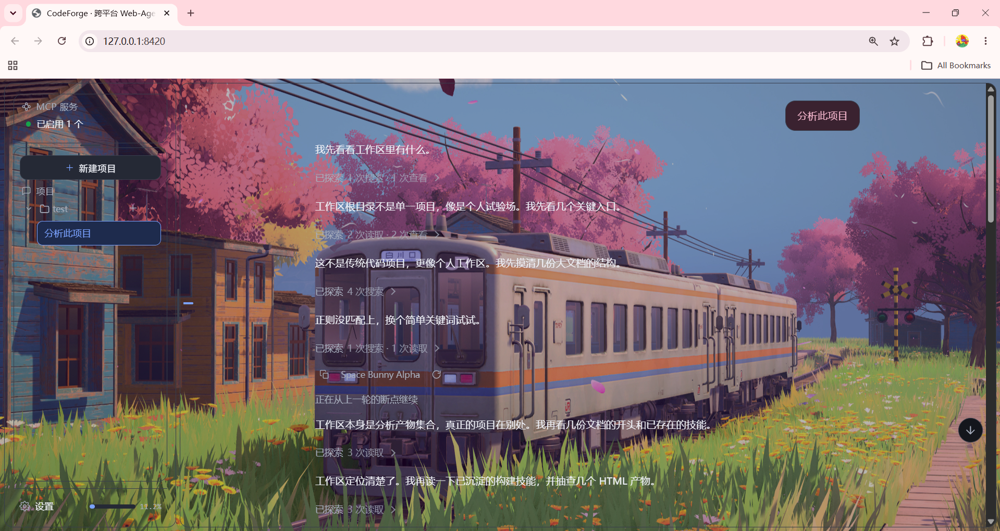
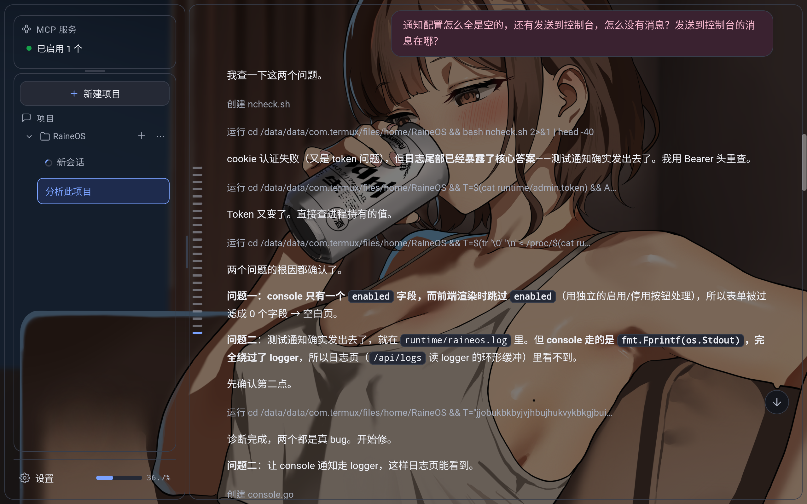

# CodeForge-Go

[English](README_EN.md) | [简体中文](README.md)

A cross-platform Web Agent written in Go. Chat in the browser; the agent reads, writes and runs commands inside your project directory.

A single static binary with zero runtime dependencies, for Windows / Linux / Android Termux.

**The UI is just a web page** — not merely a stylistic choice: it lets the same binary run on **servers with no GUI**. SSH in, start it, open it from your phone or laptop browser and you're set. On Android Termux it's the same thing, with no desktop environment dependency.

PC

Android WebView

---

## Features

### Browser UI = works without a GUI

The interface is a web page. It doesn't depend on X11/Wayland/a desktop environment, so the same binary works in all of these:

| Scenario | How |
|---|---|
| **Headless server** | Start it over SSH with `-no-open` (so it doesn't try to launch a browser); open `http://<server-address>:8420` in your local browser |
| **Android Termux** | Run it on the phone, open `http://127.0.0.1:8420` in the browser |
| **Container / NAS / Raspberry Pi** | Same as a server — just expose the port |
| **Windows / desktop Linux** | Opens the browser automatically on start |

No Electron, no frontend build step, no npm dependencies — the files under `web/dist/` are hand-written source, embedded into the binary via `go:embed`. **The whole UI travels with the binary; deployment means copying one file.**

By default it listens only on `127.0.0.1` (loopback), not exposed to the network. To reach it from another machine, edit `config/default.yaml`:

```yaml
server:
  host: "0.0.0.0"   # listen on all interfaces
  port: 8420
```

> ⚠️ Changing to `0.0.0.0` exposes the agent's file read/write capability to the network. The service ships with an access token as a safeguard, but **only do this on a network you trust**, and never expose it directly to the public internet.

Session list, model management, settings, approval cards and diff previews all live in that one interface.

### Purpose-built adaptations for Termux and low-spec environments

Not "happens to run" — specifically handled:

- **Shell detection**: on Termux it prefers `$PREFIX/bin/bash` (Android has no `/bin/bash`), falling back to `/bin/sh`.
- **Storage permission**: runs `termux-setup-storage` to request access; once granted, the `~/storage/shared` symlink becomes available.
- **Directory picker**: when there's no native folder dialog, it uses a built-in browser-style picker rooted at `~` (which always lists, unlike `/storage/shared` before permission is granted).
- **Process group management**: Android's process-termination behaviour differs from desktop Linux, so it's handled separately.
- **Soft memory ceiling**: `GOMEMLIMIT` is set to 25% of physical memory — phones usually get a far smaller memory quota than desktops, and this keeps the OOM killer away.

### Low memory footprint

Roughly 25 MB resident when idle (measured Working Set on Windows amd64). Key design decisions:

- **Soft memory ceiling**: `GOMEMLIMIT` defaults to 25% of physical memory, clamped to 256 MiB – 2 GiB. Go's GC becomes more aggressive past that point instead of waiting for the system to OOM.
  Override with `CODEFORGE_GOMEMLIMIT` (accepts `2GiB` / `512MiB` / a plain byte count; `0` disables it). Containers report *physical* memory rather than the cgroup quota, which reads too high — that's the case this override is for.
- **Active context compression**: token usage is checked before every request; if over budget, history is compressed first.
- **Tool result clamping**: tools paginate large results themselves; the Executor only truncates as a last resort, and the truncated output is still valid JSON.
- **Byte budget on the undo stack**: oversized single entries spill to disk, total size is capped, and eviction is reported rather than silent.

### Concurrent sessions

Multiple sessions can run at once inside the same project without interfering:

- **Per-session run table**: each session has its own cancel handle, so sending a message or interrupting only affects that session.
- **Undo stack bucketed per session**: A's undo can't touch B's writes, and A's large files don't evict B's snapshots.
- **Read registry isolated per session**: a file A has read doesn't give B the right to "rewrite it from memory".
- **Steering applies to the current session only**: it is never redirected just because some other task happens to be running.
- **Interrupts don't cross sessions**: pressing interrupt in B doesn't stop A running in the background.

> **Current boundary**: concurrency works fully **within one workspace**. Cross-workspace concurrency is not supported yet — the workspace is process-wide, and switching it would change what the running sessions see, so a cross-project switch is refused while a task is running (with a message saying so). Moving the workspace down into each session is work in progress.

### Cross-platform static builds

`CGO_ENABLED=0`, with an empty import table — runs on a clean machine with no runtime libraries installed.

| Platform | Artifact | Size |
|---|---|---|
| Windows amd64 | `codeforge.exe` | 16.3 MB |
| Linux amd64 | `codeforge` | 15.9 MB |
| Android arm64 (Termux) | `codeforge` | 16.4 MB |

### Built-in tools

Files: `read_file` `write_file` `edit_file` `delete_file` `list_dir` `search_files` `find_files`
Commands: `run_command`
Collaboration: `delegate_subagents` (multi-agent) `goal_verify` (goal-mode hard check)
Other: `todo_write` `save_memory` `create_skill` `web_fetch` `web_search`

### Safety constraints on file operations

These are hard rules, not options:

- **Read before write**: a file you haven't read can't be rewritten from memory. If it changed externally after being read, the fingerprint comparison catches it and refuses.
- **CAS writes**: "read current → compare → write" happens inside one per-path lock, so concurrent writes can't silently overwrite each other.
- **Atomic writes**: temp file in the same directory + rename. A process killed mid-write never leaves a half-written file.
- **Workspace fence**: paths must land inside the workspace. Escapes like "a symlink inside the workspace pointing outside, with the target not yet existing" are blocked by resolving upwards level by level.
- **Atomic undo**: a pre-write snapshot, bucketed per session, restorable byte for byte.

### Human-in-the-loop approval

Operations the policy marks as `Ask` suspend and wait for your decision in the UI. Approval has its own timeout (15 minutes by default), separate from the tool execution timeout — "user said no" and "nobody answered" are worded differently in the interface.

### Other

- **Resume from checkpoint**: an interrupted task keeps its unfinished turn; you can retry from the break or edit-and-resend.
- **System notifications**: on task completion, with visibility checks and throttling.
- **Subagents**: `delegate_subagents` fans a task out to several subagents in parallel, with progress streamed back live.
- **Goal mode**: `goal_verify` enforces a check before the task is considered done; failing it means the agent keeps working.
- **Plugins**: MCP / remote capabilities can be adapted into standard tools.

---

## Quick start

### 1. Build

```bash
# Native (the Windows artifact is bin/codeforge.exe — `go build -o bin/codeforge`
# does NOT append .exe, so write the suffix explicitly or the name won't match
# what the Makefile / cf.cmd expects)
CGO_ENABLED=0 go build -trimpath -ldflags "-s -w" -o bin/codeforge.exe ./cmd/agent

# Cross-compile
CGO_ENABLED=0 GOOS=windows GOARCH=amd64 go build -trimpath -ldflags "-s -w" -o bin/codeforge-windows-amd64.exe ./cmd/agent
CGO_ENABLED=0 GOOS=linux   GOARCH=amd64 go build -trimpath -ldflags "-s -w" -o bin/codeforge-linux-amd64      ./cmd/agent
CGO_ENABLED=0 GOOS=android GOARCH=arm64 go build -trimpath -ldflags "-s -w" -o bin/codeforge-android-arm64  ./cmd/agent
```

Or use the Makefile: `make build` / `make all-platforms` (it picks the right suffix for the host).

### 2. Configure the API key

**Keys are read from system environment variables only** — never from a key file. A file would sit in your project directory and get carried off by sync clients and backup scripts; environment variables don't.

**Linux / macOS / Termux** (persist it in your shell config):

```bash
echo 'export CODEFORGE_API_KEY=sk-...' >> ~/.bashrc
source ~/.bashrc
```

**Windows** (`setx` takes effect for new terminals):

```powershell
setx CODEFORGE_API_KEY "sk-..."
```

### Referencing environment variables in config files

Don't want to export every time? **Write `${VAR}` in YAML**; the value is pulled from the environment at load time:

```yaml
# config/providers.yaml
providers:
  - id: my-gateway
    name: Some Gateway
    base_url: ${GATEWAY_URL}/v1     # ← variable reference; no URL in the file
    protocol: openai
    key_source: plain
    key_value: ${GATEWAY_KEY}       # ← variable reference; no key in the file
```

`config/models.yaml` and `config/local.yaml` support it too:

```yaml
# config/local.yaml
llm:
  api_key: ${MY_KEY}
  base_url: ${MY_BASE_URL}
  model: gpt-4o
```

Both `${NAME}` and `$NAME` work; `\${NAME}` yields a literal. Expansion happens **in memory only** — your files are never rewritten.

**If a variable isn't set**: it's treated as empty and named in the startup log:

```
WARN  provider store config/providers.yaml references unset environment variables: GATEWAY_KEY (treated as empty; …)
```

That way one mistake out of ten doesn't make the whole file unusable, and the log tells you exactly which variable is missing — otherwise the symptom is "I configured it but it won't connect", with a 401 that points nowhere near the real cause.

### Variable name priority

If you don't write `${...}` in YAML, the program tries these in order (`applyEnvFallback` in `config/config.go`):

| Variable | Notes |
|---|---|
| `CODEFORGE_API_KEY` | **Recommended**, works for every provider, highest priority |
| `ANTHROPIC_API_KEY` | Fallback when `provider: anthropic` |
| `OPENAI_API_KEY` | Fallback when `provider: openai` / `custom` |
| `LLM_API_KEY` | Last resort (the old default name) |

> If `config/local.yaml` explicitly sets `llm.api_key` (including a `${…}` that expands), **it takes priority over the chain above**.

**Non-sensitive config** (model name, protocol, …) goes straight into YAML, or you can change it in the UI's Settings page — that writes to `config/models.yaml` and `config/providers.yaml` (both in `.gitignore`).

### 3. Start

```bash
# Option 1: launcher (chdirs to the project root internally, works from anywhere)
./cf.cmd                    # Windows
./cf-termux.sh              # Android Termux

# Option 2: run directly — pass both paths as absolute, then it doesn't matter where you are
./bin/codeforge -config /path/to/project/config -workdir /path/to/project
./bin/codeforge.exe -config "C:\path\to\project\config" -workdir "C:\path\to\project"

# Option 3: Makefile (build + start, chdirs for you)
make run
```

The browser opens <http://127.0.0.1:8420> automatically.

**Always pass `-no-open` in headless environments** — otherwise it tries to invoke `xdg-open` / a browser and fails (usually just noise in the log; the service still works):

```bash
# headless server
./bin/codeforge -no-open -config /srv/myproject/config -workdir /srv/myproject
```

Then open `http://<server-address>:8420` in your local browser.

### 4. Choose a workspace

Click "Choose workspace" in the top right, or pass it directly:

```bash
./bin/codeforge -workdir /path/to/project
```

**The workspace must be an absolute path** — a relative one is meaningless (a workspace can't be relative to itself), and if allowed through it resolves against the process CWD, so the workspace changes depending on how you launched.

A directory that doesn't exist is treated as "no workspace chosen" — it is never silently set as the working directory.

### 5. Start chatting

With a workspace selected, just type in the input box.

- **Change direction mid-run**: type and send; the instruction is merged into the current task at the next step boundary (current session only).
- **Stop mid-run**: clear the input box and press `Esc`, or click the send button.
- **Switch sessions**: click a session card in the sidebar. Sessions in the same project can run in parallel.

---

## Command-line options

```
codeforge [start]  [-config DIR] [-workdir DIR] [-no-open]   start the service (default)
codeforge stop     [-config DIR]                              stop the running service
codeforge restart  [-config DIR] [-workdir DIR] [-no-open]   restart the service
```

| Option | Meaning |
|---|---|
| `-config DIR` | Config directory, default `config` |
| `-workdir DIR` | Agent working directory (must be absolute), default: current directory |
| `-no-open` | Don't open a browser |
| `-continue` | On start, return to the most recently updated session in this workspace |
| `-resume <ID>` | On start, return to a given session: session ID / ID prefix / session title / `last` |

If a `-resume` session belongs to a different workspace, the workspace is switched first — replaying one project's conversation while the model's next step edits another project's files is exactly the failure mode this avoids.

---

## Platform notes

### Three general rules

1. **Pass both `-config` and `-workdir` as absolute paths.** After that it doesn't matter which directory you launch from; no need to fiddle with CWD (the launchers and `make run` do it for you).
2. **The workspace must be an absolute path** — a relative one is meaningless and resolves against the process CWD.
3. **A configured workspace that doesn't exist, or isn't a directory**, is treated as "no workspace chosen".

Also: **add `-no-open` when there's no graphical environment** (Termux, headless servers, containers).

### Headless servers (Linux / BSD / container / NAS)

This is the main reason the UI is a web page.

```bash
# copy it over
scp bin/codeforge-linux-amd64 user@server:/usr/local/bin/codeforge

# start (-no-open so it doesn't try to launch a browser; absolute paths so cwd doesn't matter)
./codeforge -no-open -config /srv/myproject/config -workdir /srv/myproject
```

Keys come from the system environment variable (`CODEFORGE_API_KEY`) — `export` it in the shell that starts the service.

Then, to reach it:

1. By default it listens only on `127.0.0.1`, so only the server itself can reach it. **SSH port forwarding is the least-effort path and needs no config change:**

   ```bash
   # run this on YOUR machine
   ssh -L 8420:127.0.0.1:8420 user@server
   ```

   Then open <http://127.0.0.1:8420> in the browser.

2. To reach it directly from other machines, set `server.host` to `0.0.0.0` in `config/default.yaml` and open port 8420 in the firewall. The service generates a random access token at startup and hands it out via an HttpOnly cookie; both the API and the WebSocket validate it.

   > ⚠️ Changing to `0.0.0.0` exposes the agent's file read/write capability to the network.
   > Do it **only on a network you trust**, and prefer SSH port forwarding.

To run it as a background service, use systemd:

```ini
[Unit]
Description=CodeForge
After=network.target

[Service]
ExecStart=/usr/local/bin/codeforge -no-open -config /srv/myproject/config -workdir /srv/myproject
EnvironmentFile=/etc/codeforge/env
Restart=on-failure

[Install]
WantedBy=multi-user.target
```

With systemd you **must** pass the key via `Environment=` or `EnvironmentFile=` — the service has no TTY, so it cannot see anything you `export`ed in an interactive shell.

Put `CODEFORGE_API_KEY=sk-...` in `/etc/codeforge/env`, with `chmod 600` and `chown root:root`. Keeping it in `/etc` rather than the project directory means it travels with the *configuration*, not with the *code*.

The `stop` / `restart` subcommands work the same way.

### Windows x64

Double-click `cf.cmd`, or:

```powershell
.\bin\codeforge.exe -config config
```

### Linux x86_64 / arm64

```bash
chmod +x bin/codeforge
./bin/codeforge -config /path/to/project/config -workdir /path/to/project
```

Statically linked, no dynamic library dependencies. Pass `-config` / `-workdir` as absolute paths and you never have to care about CWD.

### Android Termux arm64

No desktop environment on a phone — the UI is entirely browser-based, which is the direct payoff of making it a web page.

```bash
pkg install golang
git clone <repo> && cd codeforge-go
CGO_ENABLED=0 GOOS=android GOARCH=arm64 go build -trimpath -ldflags "-s -w" -o codeforge ./cmd/agent
chmod +x codeforge
./codeforge -no-open -config config
```

`-no-open` is mandatory on Termux — otherwise it tries to launch a system browser, which usually fails.

Open <http://127.0.0.1:8420> in the phone's browser. To reach the same service over the network, follow the headless-server section and change `server.host`.

> ⚠️ **Do not run the program from under `~/storage/shared/`.**
>
> That's Android's shared storage (a FUSE mount over internal storage), and it causes two problems:
>
> 1. **Execute permission is stripped** — shared storage is mounted `noexec`, so
>    `chmod +x` has no effect and you get `Permission denied`.
> 2. **Performance is one to two orders of magnitude worse** — every file
>    read/write crosses FUSE + sdcardfs, which noticeably slows the agent's
>    tool calls (especially `search_files` traversal).
>
> Put it under `~` (Termux's own ext4 directory) instead:
>
> ```bash
> # correct
> cd ~ && ./codeforge -no-open -config ~/codeforge-go/config
>
> # wrong: Permission denied
> cd ~/storage/shared && ./codeforge
> ```
>
> The **workspace** may point at `~/storage/shared/...` — that's just data, reads
> and writes are fine. Only the **program itself** must not live there.

Termux permissions when choosing a workspace:

- The default starting directory is `~`, which always lists.
- To reach external storage, run `termux-setup-storage` first; afterwards the `~/storage/shared` symlink is available.
- If the directory listing comes back empty on some Android versions, storage permission almost certainly wasn't granted — grant it and retry.
- Shell detection prefers `$PREFIX/bin/bash` (Android has no `/bin/bash`), falling back to `/bin/sh`.

### Minimal deployment

All you need is the binary plus `config/default.yaml` and `config/models.yaml`. `config/local.yaml`, `config/providers.yaml` and `.codeforge/` are generated on first run. Keys don't live in files — they come from the environment.

**No build toolchain required** — the binary is static; copy it and run.

---

## Configuration and keys

### Layers and who writes them

| File | Written by | Notes |
|---|---|---|
| `config/default.yaml` | Maintained by hand | Ships with the repo |
| `config/models.yaml` | UI Settings | Model library. Fields may use `${VAR}` references |
| `config/providers.yaml` | UI Settings | Provider library. Fields may use `${VAR}` references |
| `config/local.yaml` | Edited by hand | Local overrides, **never commit** |
| **System environment** | Set by you | **Where keys live**: `CODEFORGE_API_KEY`, or `${...}` referencing it from YAML |
| `.codeforge/` | The program | Sessions, audit log, undo spill, memories |

### Where keys live

**Preferred: system environment variables.** The program reads no key files — a file would sit in the project directory and be carried off by sync clients, backup scripts or `docker cp`; environment variables don't.

Three ways to write it, all equivalent:

```yaml
# 1) Explicit reference (recommended — the config file explains itself)
key_value: ${MY_GATEWAY_KEY}

# 2) Record only the variable name, read at request time (the UI's "Environment variable" option)
key_source: env
key_name: MY_GATEWAY_KEY

# 3) Configure nothing, use the built-in priority chain
#    CODEFORGE_API_KEY → vendor-specific name → LLM_API_KEY
```

**Second choice: paste it into the UI Settings page.** Convenient, but it's written in plaintext into `config/providers.yaml`.

**Fallback: `llm.api_key` in `config/local.yaml`.** Highest priority — setting it overrides the other two.

All three can coexist. To converge on a single source, clear the other two.

### Key handling is a hard constraint

`config/models.yaml`, `config/providers.yaml` and `config/local.yaml` are **all in `.gitignore`**, and matched by **filename glob** (`*models.yaml`) rather than path — so renaming the config directory doesn't defeat it.

`.gitignore` also ignores any file whose **name** contains `secret` / `credential` / `api_key` / `apikey` — the cost is that legitimate source files containing those words get silently ignored too. Avoid those words in code (the credential resolution module is `config/resolve_llm.go`).

---

## Security model

Three policy levels: **Allow / Ask / Deny**.

- Rules live in `config/default.yaml` under `security.rules`, matched in order.
- **The built-in dangerous-command blacklist has the highest priority**: things like `rm -rf /` are Denied outright and can't be overridden by the rule table.
- A condition that fails to parse is treated as **deny**, not skipped.
- Operations matching `Ask` go through human approval in the UI.
- Every tool call is written to the audit log (JSONL, rotates at 1 MiB, keeps 3 copies).

`agent.hidden_tools` (controls which tools the LLM sees) and `security.Policy` (controls what's allowed to run) are **deliberately separate**: hiding isn't the same as forbidding. Don't merge them into one switch.

---

## Subagents

`delegate_subagents` fans a task across several subagents working in parallel. Subagents have their own policy limits, kept in sync across three places (Agent / scheduler / tool schema).

Subagent operations **all reach the audit log**.

## Goal mode

`goal_verify` runs a mandatory check before a task counts as done. Failing it means the agent keeps working rather than quietly claiming success.

---

## Resuming after an interrupt

An interrupted task keeps its unfinished turn:

- The retry ring in the UI: click to restart from the original prompt (keeping the context produced so far).
- Edit-and-resend: rewrite a past user message and resend; the server truncates to that message and re-runs.
- File rollback: edit-and-resend can optionally roll back file changes made after that message.

Checkpoint state is visible in the checkpoints panel.

---

## Testing

### Go unit / integration tests

```bash
go test ./...
```

e2e is skipped by default; needs `CODEFORGE_E2E=1` and a real key.

### Frontend renderer tests (Node, zero dependencies)

```bash
node web/test/render_md.test.js
node web/test/attachments.test.js
```

**Must** run both after touching `ui.js`. The tests assert on source text, so renaming or restructuring requires updating them.

### Pre-commit self-check

```bash
gofmt -l .
go vet ./...
go test ./...
node web/test/render_md.test.js
node web/test/attachments.test.js
# cross-compile all three platforms
CGO_ENABLED=0 GOOS=windows GOARCH=amd64 go build -trimpath -ldflags "-s -w" -o bin/ ./cmd/agent
CGO_ENABLED=0 GOOS=linux   GOARCH=amd64 go build -trimpath -ldflags "-s -w" -o bin/ ./cmd/agent
CGO_ENABLED=0 GOOS=android GOARCH=arm64 go build -trimpath -ldflags "-s -w" -o bin/ ./cmd/agent
```

`go test -race` requires a C compiler (`-race` depends on cgo). Without gcc it's unavailable — which is why the concurrency guards are mostly **structural assertions** (parsing source to confirm shape) rather than race detection.

With the Makefile, `make test` / `make test-web` runs them in one go.

---

## Directory layout

```
cmd/agent/          entrypoint: flag parsing, process lifecycle, wiring
pkg/agent/          orchestration: ReAct loop, history, compression, checkpoints
pkg/tools/          tool interface, registry, executor (policy + approval)
pkg/tools/builtin/  built-in tool implementations + session guard (fence/fingerprints/undo)
pkg/tools/plugins/  plugin drivers (MCP / remote capabilities adapted as tools)
pkg/backend/        execution environment abstraction (pure-IO backend, local impl)
pkg/security/       policy evaluation and audit log
pkg/server/         HTTP + WebSocket server
pkg/llm/            LLM adapters (SSE streaming)
pkg/store/          SQLite persistence
pkg/platform/       platform differences (shell, process groups, paths)
pkg/errs/           error classification
pkg/logx/           structured logging
web/dist/           frontend (hand-written single file, no build step)
config/             configuration (see "Configuration and keys")
```

---

## Tech choices

| Area | Choice | Why |
|---|---|---|
| Language | Go | Single static binary, cross-platform, predictable memory |
| Storage | SQLite (`modernc.org/sqlite`, pure Go) | Zero external dependencies, statically compiles with `CGO_ENABLED=0` |
| Frontend | Hand-written single-file JS | No build step means no `node_modules` and no version drift |
| Dependencies | Very few | Static builds and artifact size are product goals |

---

## License

See the repository.
